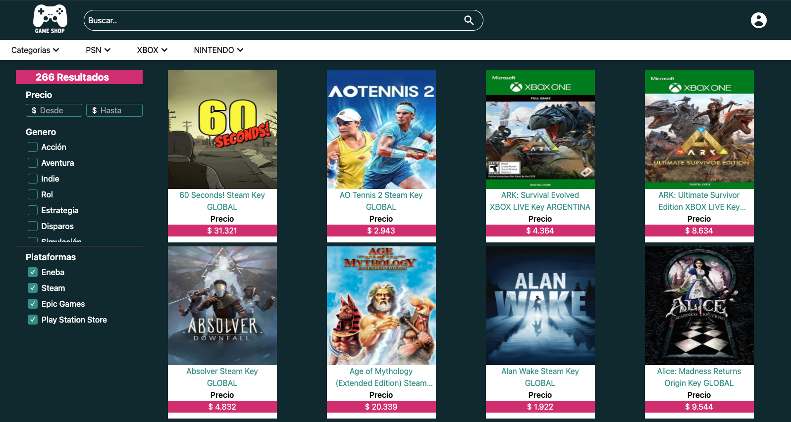

# Tienda de videojuegos
## Ejemplo de proyecto con Next.js consumiendo el backend generado por [este proyecto](https://github.com/felipetorresjara/Node-e-commerce)


[](https://nextjs.org/)
[](https://tailwindcss.com/docs/guides/nextjs)


<a href="./preview.png"></a>


## Instalación

para instalar las dependencias ubicadas en package.json

```sh
npm install
```

For production environments...

## Ejecutar 

Para ejecutar la applicación, puedes hacerlo en modo desarrollo o modo producción.

Ejecutar para desarrollo:

```sh
npm run dev
```

Ejecutar para producción

```sh
npm run start
```